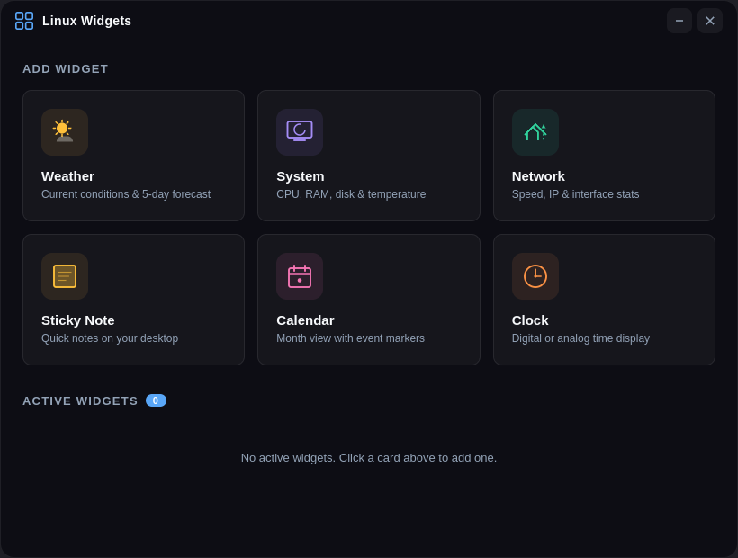

# Linux Widgets

Beautiful, transparent desktop widgets for Linux with a modern glassmorphism design. Create customizable widgets that float on your desktop for weather, system monitoring, network stats, sticky notes, calendar, and clock.



## Features

### Widget Types

- **Weather** - Live current conditions and 5-day forecast via [Open-Meteo](https://open-meteo.com/) (no API key needed). Auto-detects your location. Celsius/Fahrenheit toggle.
- **System** - Real-time CPU, RAM, disk usage, and CPU temperature displayed as animated ring gauges. Reads directly from your system via `systeminformation`.
- **Network** - Live download/upload speeds with a scrolling graph, interface name, IP address, MAC, and total transfer stats. Actual byte-delta calculations, not estimates.
- **Sticky Notes** - Quick desktop notes with auto-save. Customizable font size and color.
- **Calendar** - Full month view with today highlighted, previous/next navigation, and Monday or Sunday week start.
- **Clock** - Large digital time display with 12/24h format, optional seconds, and date line.

### Visual Design

- **Glassmorphism** - Semi-transparent dark backgrounds with real `backdrop-filter: blur()`, giving a frosted glass appearance
- **Accent glow** - Colored gradient bar along the top edge of each widget
- **Smooth animations** - Widgets scale-in on creation, gauges animate with easing, numbers transition smoothly
- **Hover-reveal controls** - Close and settings buttons only appear when you mouse over a widget
- **Fully responsive** - All widgets scale their content fluidly when resized using `clamp()`, flex layouts, and relative units
- **Frameless & transparent** - No window chrome, true transparent backgrounds

### Customization (per widget)

Every widget has its own settings panel (click the gear icon) with:

- **Accent color** picker - changes the glow bar and highlight elements
- **Background opacity** slider - from nearly invisible to solid
- **Blur amount** slider - control the frosted glass intensity
- Type-specific options (temperature unit, update interval, font size, 12/24h, week start, etc.)

### Desktop Integration

- **System tray** icon with right-click menu to quickly spawn any widget type
- **Widget Manager** window with card-based launcher and active widget list
- **Position & size persistence** - widgets remember where you placed them across restarts
- **Settings persistence** - all customization saved to `~/.config/linux-widgets/widgets.json`
- Widgets are **always below** normal windows by default (desktop layer)

## Installation

### From Source

```bash
git clone https://github.com/PyroSoftPro/LinuxWidgets.git
cd LinuxWidgets
npm install
npm start
```

### First Launch

On first launch, the Widget Manager opens automatically. Click any card to spawn a widget. After that, use the system tray icon (four colored squares) to manage widgets.

## Usage

| Action | How |
|---|---|
| Open Manager | Click the tray icon or right-click > Widget Manager |
| Add Widget | Click a card in the manager, or right-click tray > Add... |
| Move Widget | Drag the top area of any widget |
| Resize Widget | Drag any edge or corner |
| Widget Settings | Hover over widget, click the gear icon |
| Close Widget | Hover over widget, click the X |
| Remove Widget | Click the X button on its row in the manager |
| Quit | Right-click tray > Quit |

## Data Sources

All data is **live and real** - there is no mock or placeholder data.

| Widget | Source |
|---|---|
| Weather | [Open-Meteo API](https://open-meteo.com/) (free, no API key) |
| Location | [ip-api.com](http://ip-api.com/) (auto-detect by IP) |
| System | [systeminformation](https://github.com/sebhildebrandt/systeminformation) (reads `/proc`, `/sys`, etc.) |
| Network | [systeminformation](https://github.com/sebhildebrandt/systeminformation) (real interface byte counters) |
| Calendar | JavaScript `Date` (real system date) |
| Clock | JavaScript `Date` (real system time, ~200ms updates) |

## Tech Stack

- **Electron** - Cross-platform desktop shell with transparent frameless windows
- **systeminformation** - Comprehensive system data (CPU, memory, disk, network, temperature)
- **Open-Meteo** - Free weather API, no registration required
- Vanilla HTML/CSS/JS - no frontend framework, minimal dependencies

## Requirements

- Linux with X11 or Wayland (tested on Ubuntu/GNOME)
- Node.js 18+
- Internet connection (for weather data only)

## License

Copyright (C) 2025 PyroSoft Productions

This program is free software: you can redistribute it and/or modify it under the terms of the GNU General Public License as published by the Free Software Foundation, either version 3 of the License, or (at your option) any later version.

This program is distributed in the hope that it will be useful, but WITHOUT ANY WARRANTY; without even the implied warranty of MERCHANTABILITY or FITNESS FOR A PARTICULAR PURPOSE. See the [GNU General Public License](LICENSE) for more details.
